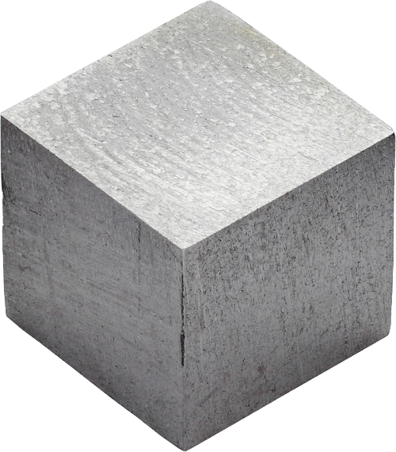

    
    
    
    
    

# LEADEN

Light Ebuild Automated Development Environment Notebook

    

# About

**Warning! Work in Progress!**

Leaden is a simple IDE-like editor for gentoo ebuild scripts.

Leaden is written in python using pyqt Qt5 bindings.

The reason for a graphical editor as opposed to console interface one is that we don't have to add any editor specific keyboard bindings and it would be generally faster than relying on knowledge of Emacs Vi.

Some functions of Leaden may be also called from console. Run `leaden --help` to get more info about those.

# Installation

## Dependencies

- portage
- pyqt
- repoman

## Manual

- clone this project using git
- run `make install`

## Ebuild

- add src_prepare overlay
- run `sudo emerge -av --autounmask dev-util/leaden`

# License

GNU GPL Version 3
